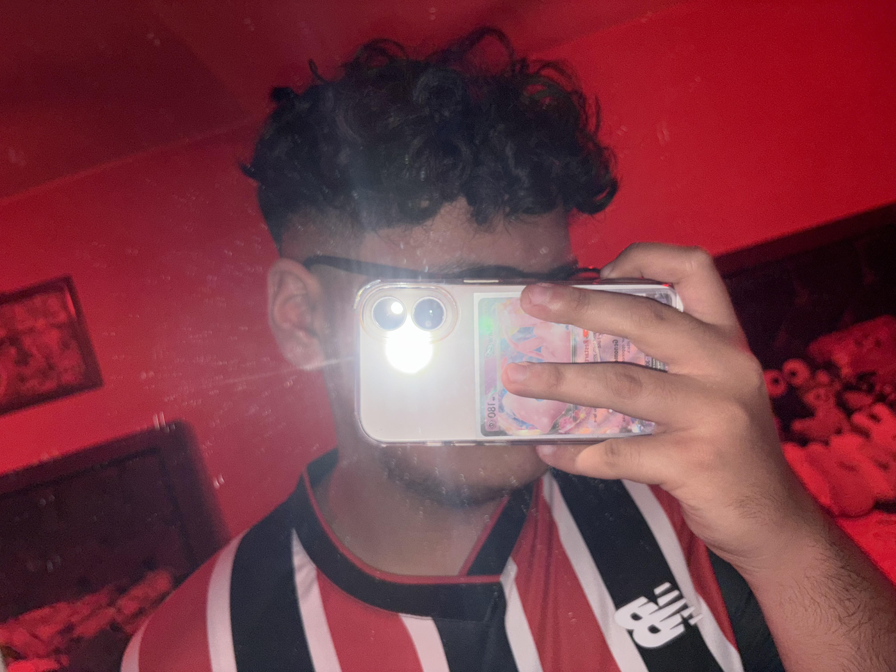

# Gael Saucedo

Hola soy gael, escogi esta carrera ya que me gustan mucho los videojuegos y antes de entrar a la universidad creia que lo mejor seria estudiar algo relacionado a lo que me gustara hacer en mi dia a dia en este caso jugar videojuegos, asi fue, es una carrera con su complejidades pero creo que me pude adaptar.
Me gustaria dedicarme a la ia, creo que es un campo nuevo y tiene mucho futuro ademas de ser muy interesante.

## Pasatiempos

1. Jugar videojuegos, en especial valorant
2. Escuchar música
3. Ver anime

## Contacto

- Correo: saucedo.gael1612@gmail.com
- Instagram: https://instagram.com/uurrllii

## Mi foto

## Entregables

- [Apuntes](mds/apuntes.md)

## Entrega 2

[Practica 2](mds/ramas-fusiones.md)

[Practica 3](/mds/etiquetas.md)

[Practica 4](/mds/primer-parcial.md)

[Practica 6](/docs/Pong.md)

[Practica 7](https://urli-gg.github.io/entregas-lenguajes-interpretados/index.html)
