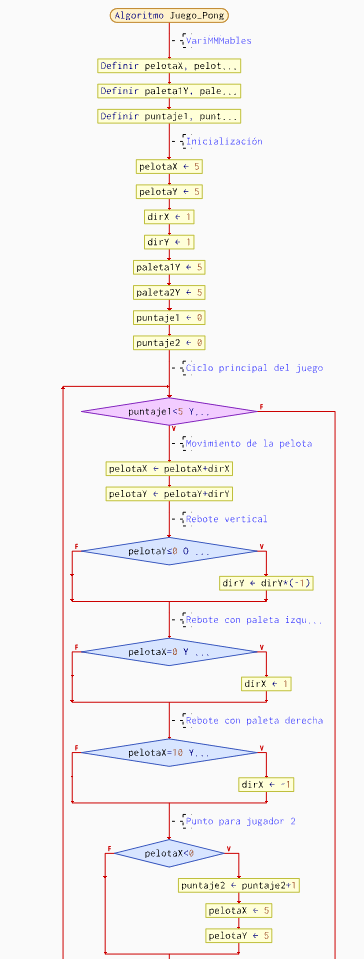
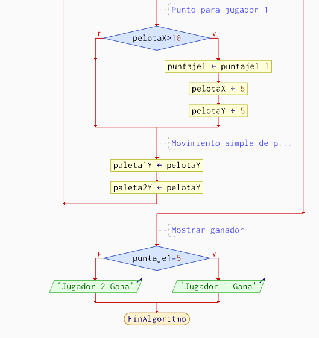

# Pong

## Historia del Juego

Pong es uno de los primeros videojuegos arcade y fue creado por Atari en 1972. Su desarrollo estuvo a cargo de Allan Alcorn, quien diseñó una sencilla simulación de tenis de mesa. Pong marcó el inicio de la industria de los videojuegos y se convirtió en un fenómeno comercial que impulsó el crecimiento de Atari y el sector de los videojuegos en general.

## Reglas y Mecánicas del Juego

- Dos jugadores controlan paletas verticales situadas en los extremos opuestos de la pantalla.
- Una pelota se mueve continuamente en diagonal, rebotando en las paletas y en las paredes superior e inferior.
- Cada jugador debe mover su paleta arriba o abajo para evitar que la pelota pase por su lado.
- Si un jugador no logra detener la pelota y esta pasa su borde, el oponente suma un punto.
- El juego termina cuando un jugador alcanza el puntaje máximo predeterminado.

## Algoritmo del Juego

1. Inicializar posiciones de las paletas y la pelota (en el centro).
2. Mostrar la interfaz del juego.
3. Comenzar el bucle principal:
   - Leer entrada de los jugadores (arriba o abajo).
   - Actualizar posición de la pelota según su velocidad y dirección.
   - Verificar colisiones:
     - Con paletas: invertir dirección horizontal.
     - Con paredes superior/inferior: invertir dirección vertical.
     - Con los bordes: si la pelota sale por la izquierda o derecha, sumar punto al jugador contrario y reiniciar la pelota en el centro.
   - Actualizar el marcador.
   - Verificar si un jugador alcanzó el puntaje máximo.
4. Mostrar mensaje de ganador y finalizar el juego.

## Diagrama de Flujo del Juego

## Promt para el videojuego

Necesito que en base al diagrama de flujo y al juego en si me hagas un codigo en html para desarrollar el juego de pong.

## Link de conversacion con ia

https://www.perplexity.ai/search/estoy-haciendo-una-practica-pa-HBcMNvlzR1OSCpP4CeCpWQ
